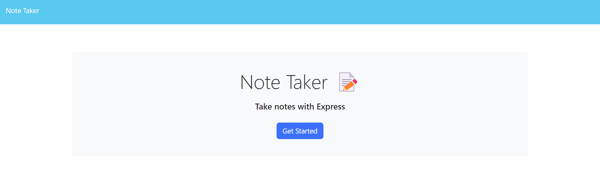
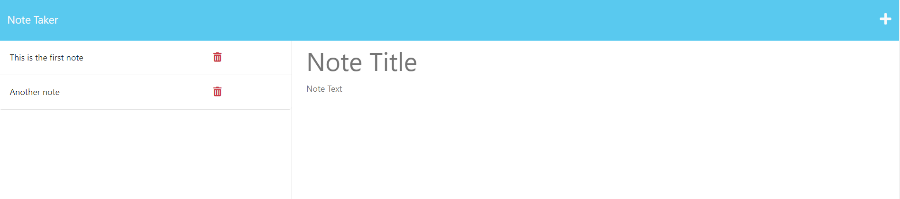

# Express.js Note Taker

## Description

The aim of this project was to create a note taking app using Express.js. This application allows one to create, save, read, and delete notes. Working on this project provided me with further understanding on the Express routes and how to connect the back-end and the front-end in an app.

## Usage

On the main page a user will be prompted to enter the note taker app. Once in the app, the user will see the titles of their notes on the left side of the screen and a space to create a new note on the right. The user will be able to view a full note by clicking on its title, create a new note by clicking on "+", and save it to the notes list. Each note can also be deleted.  
[Note Taker App](https://expressjs-note-taker2303.herokuapp.com/)  
  

## Credits

Luba Mintsys. https://github.com/lmintsys

## License

MIT License

Copyright (c) 2023 lmintsys

Permission is hereby granted, free of charge, to any person obtaining a copy
of this software and associated documentation files (the "Software"), to deal
in the Software without restriction, including without limitation the rights
to use, copy, modify, merge, publish, distribute, sublicense, and/or sell
copies of the Software, and to permit persons to whom the Software is
furnished to do so, subject to the following conditions:

The above copyright notice and this permission notice shall be included in all
copies or substantial portions of the Software.

THE SOFTWARE IS PROVIDED "AS IS", WITHOUT WARRANTY OF ANY KIND, EXPRESS OR
IMPLIED, INCLUDING BUT NOT LIMITED TO THE WARRANTIES OF MERCHANTABILITY,
FITNESS FOR A PARTICULAR PURPOSE AND NONINFRINGEMENT. IN NO EVENT SHALL THE
AUTHORS OR COPYRIGHT HOLDERS BE LIABLE FOR ANY CLAIM, DAMAGES OR OTHER
LIABILITY, WHETHER IN AN ACTION OF CONTRACT, TORT OR OTHERWISE, ARISING FROM,
OUT OF OR IN CONNECTION WITH THE SOFTWARE OR THE USE OR OTHER DEALINGS IN THE
SOFTWARE.
